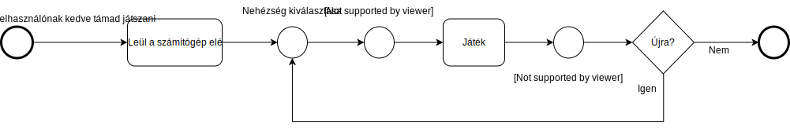

Sudoku Funkcionális specifikáció
==========================================

### 1. Jelenlegi helyzet
A mai napokban szinte lehetetlen a klasszikus játékokat jó minőségű
formában elérni, pedig az igény ezekre a csodálatos alkotásokra még mindíg
óriási. A jó minőség alatt a legtöbb esetben inkább a játék különböző lehetőségeivel való élés illetve a többjátékos mód értendő. Manapság ha rákeresünk egy klasszikus 80as vagy 90es játékra, akkor a legegyszerűbb változatukat találnánk meg, vagy pedig egy annyira megváltoztatott játékot ami már nem is nevezhető ugyanannak a játéknak. Mindezekfölött, az előbb említettek minden esetben elveszik úgy a fiatalok kedvét mint a már idősebb generációk kedvét a játéktól. Manapság a játékok egyre több erőforrást vesznek igénybe, ami nagyon költséges tud lenni, főleg a technológia robbanószerű fejlődése miatt, nem túlzás azt kijelenteni, hogy a legfrissebb játékokat 'teljesen kiélvezni', kis vagyonba kerül, még akkor is ha csak 1-2 alkatrészt kell vásárolni. A már meglévő klasszikus játékok vérszegényen vannak megvalósítva, de ez probléma könnyen lehet orvosolható úgy, hogy hatékonyabban, modern technológiákkal építjük újra az ikonikus gyermekkori játékokat. Egyre kevesebb olyan játékot látunk amely széleskörű felhasználóbázisnak tud minőségi időtöltési lehetőséget biztosítani megengedhető pénzügyi kereteken belül. Mindezek felül, manapság a játéktermek mennek ki a divatból és egyre nehezebb egyetlen helyen megtalálni azokat a klasszikus játékokat, amiért régen siettunk haza iskolából.A legnagyobb hátrány a többjátékos mód hiánya, hiszen egyedül játszani egy olyan klasszikus játékkal mint például a sudoku nagyon hamar monotonná tud válni, ezen persze enyhítenek a külonféle játékmódok, amelyek megnehezítik a felhasználó dolgát, de egy bizonzos szinten mindenkiben jelen van a kompetitív szellem és legalább egyszer szeretné megmérettetni magát egy másik játékos ellen. Bizonyos helyeken próbálták megfogni a kompetitív szellemet, de helytelenül, hiszen a felhasználónak bár megengedték, hogy felmérje más játékos ellen a tudását, az nem volt biztosítva, hogy hasonló szintű legyen az ellenfél így lehetséges volt az, hogy egy teljesen zöldfülű játékos aki most kezdte a játékot, egy olyan valaki ellen küzdjön, aki már évek óta aktívan játszik viszonylag versenyszerűen. Amit a cég biztosítani fog:   
* Klasszikus sudoku
* Szabálytalan sudoku
* X sudoku
* Samurai sudoku
* A backend ami támogatja a többjátékos módot
* Az üzleti logika tesztelése
* Manuális tesztek végrehajtása, mielőtt továbbadnánk a megrendelőnek
* Egyszerű és intuitív felhasználói felület
* Saját sudoku generáló rendszer
* Pontrendszer
### 2. Vágyálom rendszer
##### 2.1 Főmenü
A játék elindításakor a felhasználó a főmenüt látja először. Innen gombok segítségével almenükbe navigálhat tovább, melyek a következőek:
- Új játék: Ez a menüpont egy olyan oldalra visz tovább, ahol megadhatjuk a játékunk beállításait, majd elkezdhetjük azt.
- Statisztikák/Ranglétra: A saját statisztikáinkat és a többi játékossal összemért eredményeinket láthatjuk.
- Beállítások: A program konfigurálására alkalmas oldalra visz.
- Kilépés: Bezárja a programot.

##### 2.2 Új játék menüpont
Ebben a menüpontban a játékos kiválaszthatja, milyen játékot szeretne indítani, majd továbbnavigálhat a játék oldalra. Alternatívaként visszamehet a főmenübe, ha mégsem szeretne játékot indítani.

Az új játék tulajdonságait három, egymástól függetlenül állítható listából lehet kiválasztani:
- Játék típus: kiválasztható, hogy milyen típusú sudoku játék induljon.
- Nehézség: megadja, hogy mekkora kihívást jelentő pályát generáljon a játék.
- Játékmód: eldönthető, hogy egyedül, vagy párharcban szeretnénk játszani.

##### 2.3 Játék
A felhasználó kap egy sudoku táblát, melyet a játék szabályainak megfelelően ki kell töltenie. Minden kitöltött elemnél a program opcionálisan ellenőrzi, hogy a cellába a megfelelő szám került-e, jelezve hiba esetén.

A kitöltés módszere:
- Navigálás a cellák között a nyílbillentyűk (<kbd>&uarr;</kbd>, <kbd>&larr;</kbd>, <kbd>&darr;</kbd>, <kbd>&rarr;</kbd>), vagy a <kbd>W</kbd>, <kbd>A</kbd>, <kbd>S</kbd>, <kbd>D</kbd> billentyűk segítségével. Amennyiben az adott irányban már nincs több cella, a fókusz a tábla ellenkező felére ugrik.
- Számok bevitele az <kbd>1</kbd>-<kbd>9</kbd> billentyűk vagy numpad <kbd>1</kbd>-<kbd>9</kbd> billentyűk segítségével.
- A kitöltés és a javaslat mód közötti váltás az <kbd>S</kbd> (mint "suggestion") billentyűvel, vagy az erre való gombbal.

A játék befejezésekor eredményünk regisztrálódik a ranglétrára, és új játékot kezdhetünk azonos, vagy más beállításokkal, esetleg visszatérhetünk a főmenübe.

##### 2.4 Statisztikák és ranglétra
Ebben a menüpontban megtekinthetjük, hogy profilunk milyen játékadatokkal rendelkezik, és hogyan teljesít a többi játékossal szemben. Amennyiben nem vagyunk bejelentkezve, vagy nincs internetkapcsolatunk, ez a menü nem érhető el.

Az első kategóriába olyan adatok tartoznak, mint a játékban töltött összidő, a lejátszott és a sikeresen kitöltött játékok száma, a megnyert párbajok száma, valamint ugyanezen adatok sudoku típusonként lebontva.

A második kategória egyszerű listákból áll, ahol láthatjuk, melyik játékos hanyadik helyen helyezkedik el a listában. A listák időtartamonként (napi, heti, havi, éves, és örök ranglétra), valamint sudoku típusonként vannak lebontva. Opcionálisan szűrhetünk játékmódra is, vagyis hogy egyedül, vagy párban játszottunk. A sorrend megállapításának alapja a megnyert játékok időtartama, a sikeresen teljesített valamint a feladott játékok aránya, és a nehézségi szint szorzója.

##### 2.6 Beállítások
Itt a felhasználó megtekintheti és módosíthatja a program beállításait, valamint kezelheti a fiókját.

A beállítások a kezdeti verzióban a következőek:
- ellenőrzés ki-/bekapcsolása: megadja, hogy a játék során egy adott mező kitöltésekor annak tartalmát leellenőrizze-e a program
- hang ki-/bekapcsolása: megadja, hogy a kiválasztott mező megváltozásakor legyen-e hanghatás
  
A felhasználó kezelése a kezdeti verzióban a következő műveletekkel rendelkezik:
- ki- és bejelentkezés
- felhasználó törlése
- felhasználó megjelenítési nevének módosítása

### 3. Jelenlegi üzleti folyamatok modellje
A következő folyamatábra a jelenlegi üzleti folyamatokat próbálja meg bemutatni a felahasználó szemszögéből:

Nyilvánvalóan egy Sudoku feladvány megoldásáról szól a folyamatábra. Ha felhasználónknak nincs otthon valamilyen formában megoldatlan Sudoku feladványa, akkor el kell mennie boltba.
Ott ki kell választana egy számára megfelelő feladatgyűjteményt, vagy újságot. Ezután következik a fizetés, majd a hazajutás. Ez jó esetben 5-10 percet vesz igénybe, rosszabb esetekben órákról is szó lehet.
Ha van otthon kitöltetlen, megfelelő nehézségű és játékmódú feladvány, akkor természetesen egy pár pillanat alatt letudja a felhasználó. 
Ha egyedül szeretne játszani, akkor már kész is van minden teendővel. Ellenkező esetben össze kell hívnia barátait, majd a nyomdában sokszorosítani a feladványokat. Rosszabb esetben ez is órákig tarthat.
A feladat sikeres megoldása után újrakezdődik az egész folyamat, vagy a felhasználó nem játszik tovább.

### 4. Igényelt üzleti folyamatok modellje
A következő folyamatábra az igényelt üzleti folyamatokat próbálja meg bemutatni:

A folyamatábra szintén egy vagy több Sudoku feladvány megoldásáról szól, ellenben digitális formában, ezzel jelentősen leegyszerűsítve a fenti ábrát. 
A felhasználónak, ha játszani támad kedve, nem kell boltba utaznia, csupán leülnie a számítógépe elé.
Miután megnyitotta az alkalmazást eldönti, hogy milyen nehézségen szeretne játszani, illetve kiválasztja a számára legmegfelelőbb játéktípust.
Ezután már kezdődhet is a játék. A feladvány sikeres elkészítése esetén opcionálisan elmentheti a pontszámait, mellyel részt vehet a rangsorolásban, amivel a barátok összemérhetik az eredményeiket.
Amennyiben nem sikerült elkészíteni, akár el is mentheti és később onnan folytatja, ahol abba hagyta. 
