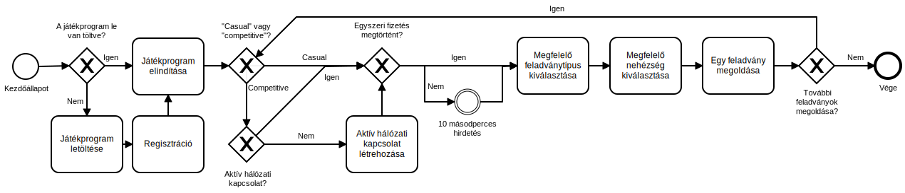

Sudoku Követelményspecifikáció
==========================================

### 1. Áttekintés
A termék egy olyan rés betömését célozza meg, mely valamilyen módon a mai napig kihasználatlan maradt: nincsen olyan sudoku program, mely az alapvető 9x9-es sudoku-n kívül más típusokat is ismerne, vagy többjátékos módot tartalmazna. A cél eléréséhez a játékosok számára egy olyan egyszerűen használható, de mégis minden szükséges funkciót tartalmazó játékot kell létrehozni, mely a lehető legtöbb féle-fajta sudoku játékot tartalmazza.

A játéknak megfelelőnek kell lennie a versenyszellemű játékosoknak is (az olyan funkciókkal, mint a párbaj, vagy a ranglétra), de alkalmazkodnia kell az olyanok igényeihez is, akik csak nyugodtan szeretnének játszani (tehát nem szabad teljesítmény alapján lezárnia az egyes funkciókat, mint a nehéz mód).

Ahhoz, hogy minden funkciót élvezhessünk, szükség van egy internatkapcsolatra, azonban a legtöbb anélkül is elérhető. Gépigény szempontjából egy ilyen egyszerű játék nem szabad, hogy túl nagy szükségletekkel rendelkezzen.
 
### 2. Jelenlegi rendszer
A mai napokban szinte lehetetlen a klasszikus játékokat jó minőségben megtalálni.
A jó minőség alatt a legtöbb esetben inkább a játék különböző lehetőségeivel való
élés illetve a többjátékos mód értendő. Manapság ha rákeresünk egy klasszikus
játékra mint például a pacman vagy sudoku, akkor a legegyszerűbb változatukat
találnánk meg, vagy pedig egy annyira megváltoztatott játékot ami már nem is   nevezhető  ugyanannak a játéknak.Mindezekfölött, az előbb említettek minden esetben elveszik  úgy a fiatalok kedvét mint a már idősebb generációk kedvét a játéktól.Manapság a játékok   egyre több erőforrást vesznek igénybe, ami nagyonköltséges tud lenni, főleg a technológia   robbanószerű fejlődése miatt, nem túlzás azt kijelenteni, hogy a legfrissebb játékokat   'teljesen kiélvezni', kis vagyonba kerül, még akkor is ha csak 1-2 alkatrészt kell vásárolni. Egyre kevesebb olyan játékot látunk amely széleskörű felhasználóbázisnak tud minőségi  időtöltési lehetőséget biztosítani megengedhető pénzügyi kereteken belül.Mindezek felül,  manapság a játéktermek mennek ki a divatból és egyre nehezebb egyetlen helyen megtalálni  azokat a klasszikus játékokat, amiért régen siettunk haza iskolából.
### 3. Vágyalom rendszer
##### 3.1 Célok, összegyűjtött játékok
Célunk egy olyan játékprogram létrehozása, mely egy helyen gyűjti össze a különböző típusú és nehézségű sudoku játékokat, melyeket minden játékos szabadon elérhet. Ezek közé tartozik a
- hagyományos sudoku
- killer sudoku
- sudoku X
- samurai sudoku
- szabálytalan sudoku
- ezek esetleges lehetséges kombinációi, például a samurai sudoku X

Abban az esetben, ha felmerülne a felhasználói igény egy olyan típusú játék hozzáadására, mely addig nem szerepelt a játszató típusok körében, fontos, hogy az gyorsan és zökkenőmentesen hozzáadható legyen.
##### 3.2 Egyjátékos mód
Egyjátékos módban a játékos a fent felsorolt játékmódok és fokozatosan nehezedő szintek közül választva játszhat le egy sudoku játékot. Az újrajátszhatóság érdekében fontos, hogy ne kézzel készített, hanem géppel generált játékokról legyen szó.
Az egyes játékok idejét méri a program, ezzel is visszajelzést adva a játékosok számára, valamint erősítve a kompetitív szellemet. A kevésbé versenyorientált játékosok számára lehetőség nyílik a mentésre, és későbbi folytatásra onnan, ahol legutóbb abbahagyták.
A bevitelt tekintve egérrel és billentyűzettel is játszható lesz a játék, vagy akár azoknak a kombinációjával. Így sok különféle preferenciájú játékos találhatja meg a számára megfelelő és kényelmes módot a számok beírására.
A számok megjelenhetnek javaslatként, mely esetben egy mezőben minden szám egyszerre is jelen lehet. Ez nagyban megkönnyíti a különféle lehetőségek és gondolatmenetek fejben tartását.
##### 3.3 Többjátékos mód
A fentieken felül lehetősége lesz a játékosoknak tudásukat más játékosokkal összemérni akár ugyanazon rejtvény egyszerre való megoldása által, akár az átlagos teljesítményük rangsorolása által.
Előbbi esetben a játék ugyanazt a rejtvényt legenerálja mindkét játékos számára, és az a játékos nyer, aki hamarabb képes megoldani azt. A teljesítménybeli különbség további mértéke lehet, ha a program figyelembe veszi, hogy a vesztes játékos hány százalékban töltötte ki a rejtvényt addig az időpontig, amíg a nyertes játékos teljes megoldást adott.
##### 3.4 Igények
A program használatához elegendő lenne egy viszonylag kisebb teljesítményű számítógép, hiszen a sudoku nem egy grafikailag intenzív játék. Ez megengedné, hogy eljusson a potenciális játékosok egy nagyon széles köréhez, hiszen manapság ritka az olyan gyenge gép, mely ennyire statikus grafikai elemek megjelenítésével sem boldogul.
A funkciók teljes tárházának kihasználásához internetkapcsolat is szükséges, azonban a játék működne enélkül is egyjátékos módban, a rangsorok megjelenítése nélkül. A rangsort ebben az esetben helyileg menti, és helyreállt internetkapcsolat esetén szinkronizálja a szerverrel.
##### 3.5 Összefoglalás
Egy ilyen program használata jóval egyszerűbb lenne a jelenlegi helyzethez való alkalmazkodásnál, hiszen megszüntetné annak szükségét, hogy több programot használjunk nagyon hasonló cél elérésére.
A kívánt játéktípust és -nehézséget, valamint az egy- vagy többjátékos módot néhány kattintással ki lehet majd választani ahelyett, hogy a megfelelő program után kéne kutakodni minden különböző játék esetén.

### 4. Jelenlegi üzleti folyamatok modellje
Mint ahogy azt a következő folyamatábrán is lehet látni, a játékprogram nélküli, fizikai alapon való Sudoku-zás menete elég bonyolult tud lenni.

Nyílvánvalóan a legegyszerűbb eset az, amikor csak magunkhoz tudjuk kapni az újságot és megoldunk egy feladványt.
Ez nem mindig van így sajnos. Ennél bonyolultabb helyzet alakul ki akkor, ha nincs épp újságunk, vagy van, de épp nincs megfelelő Sudoku az újságban. Minden ehhez hasonló alkalommal le kell menni a boltba, és költekezni.   
Ha valaki időre, mások ellen szeretne játszani, akkor a  barátokkal való játék is elég kényelmetlen tud lenni, és több szervezést igényelhet.
### 5. Igényelt üzleti folyamatok modellje
A következő folyamatábra a játékprogram segítségével történe Sudoku-zás menetrendjét mutatja be:

Elsőre bonyolultabbnak tűnhet, mint a korábbi ábra, de itt minden elágazás során a rosszabbik eset csak pár kattintással számít rosszabbnak, míg ezelőtt percekkel/órákkal voltak rosszabbak a rossz esetek. Például az előző módon, ha többszemélyes játékot akartunk játszani, akkor össze kellett gyűjteni barátainkat, és mindenkinek feladatot kellett biztosítanunk.
Jelen esetben csak aktív internetkapcsolatra van szükségünk, és ezután már csak egy kattintás választ el minket a többjátékos módtól. Ha barátainkkal szeretnénk játszani, akkor őket is csak egyszer kell összegyűjteni, és legközelebb már a barátlistánkban fognak szerepelni.
   
   Ezek után minden egyes feladat (nehézség választás, játékmód választás stb.) 2-3 kattintással elvégezhető.