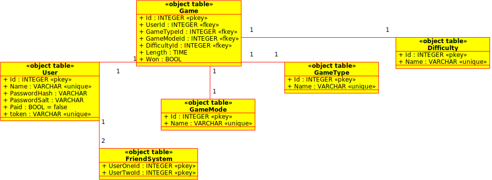

Sudoku Rendszerterv
=============================

### 1. A rendszer célja
##### 1.1 Jelenlegi célok
A rendszer célja jelenleg az, hogy egy platformot tudjunk biztosítani a Sudoku játék rajongóinak.
A platformon eleinte elérhető lenne a "kényelmes", (casual) illetve "versengő" (competitive).
A rendszerben Normál Sudoku, Killer Sudoku, X Sudoku, Samurai Sudoku, Szabálytalan Sudoku, illetve személyre
szabott Sudoku játékmód lesz elérhető első lépésként, kezdő, normál és nehéz nehézségben.   
A játék során szerzett ismerettségeket fenntartását, illetve a barátainkkal való kapcsolattartást játékon belül a barátlista funkció 
támogatja.
##### 1.2 Jövőbeli célok
A platform hosszútávú célja Sudoku-event-ek rendezése, országos-, regionális-, világbajnokságok rendezése,
non-profit adománygyűjtő események szervezése. Több játékmód, illetve a "Lehetetlen" nehézségi mód implementálása
is elkerülhetetlen a nagyobb eseményeken való megfelelő nehézségű feladat biztosításához.
Csetrendszer implementálása, így a barátlista funkció több értelmet nyer.
### 2. Projekt terv
##### 2.1 Sprintek
A fejlesztést kéthetes szakaszokra, sprintekre osztjuk. Minden sprint végén összegezzük az sprint feladatait, és megtervezzük a következő sprintet:
* Kitaláljuk milyen feladatokat teljesítünk
* Felosztjuk egymás között a feladatokat
* Beosztjuk, hogy melyik feladatot meddig illene megcsinálni 

A sprintek témája a fejlesztés során fog kialakulni. A sprintek időbeli beosztása:
*  \#1. Sprint: 2019. 10. 08. - 2019. 10. 21.
*  \#2. Sprint: 2019. 10. 22. - 2019. 11. 04.
*  \#3. Sprint: 2019. 10. 05. - 2019. 11. 18.
*  \#4. Sprint: 2019. 11. 19. - 2019. 12. 02.
*  \#5. Sprint: 2019. 12. 03. - 2019. 12. 16.
##### 2.2 Feladatkövető rendszer használata
Trello-n minden egyes nagyobb feladathoz (továbbiakban issue) létrehozunk egy Epicet, amelyet a megfelelő "Epics" listában tárolunk.
A feladatot részekre bontjuk és mindegyik részfeladatnak külön issue-számot adunk, és kártyát hozunk létre a "Backlog" listába. Minden részfeladathoz beállítjuk a határidőt,
illetve a megbízott fejlesztőt. Ha a feladatot a fejlesztő elkezdi csinálni, akkor a "Backlog" listából átkerül a feladat kártyája az "In progress" listába.
Ha a fejlesztő kész van az adott issue-val, és egy másik fejlesztő jóváhagyására vár, akkor az "In testing" listába kerül a kártya.
Ezután, ha a jóváhagyás megtörtént, akkor a kártya a "Done" listába kerül át, és "kész"-nek jelöli a fejlesztő.
Ha egy Epic minden részfeladata készen van, akkor az Epic-et a "Complete Epic" funkcióval le kell zárni-
Minden Sprinthez tartozik egy kártya, aminek nincs issue-száma. A sprint kártyákhoz csatolva vannak a sprintben aktuális Epic kártyák, és
az Epic nélküli issue-k is.
#### 2.3 Verziókezelő rendszer használata
Minden Trello-s issue-hoz, amely a forrás változtatását kívánja, létrehoz a kijelölt fejlesztő egy branch-ot, "S*n*" névvel, ahol az *n* az issue számát jelöli.
Minden commit-ot a branch nevével kell kezdeni, jelen időben (Present Simple). A commit címének végén nincs pont. Angol nyelven kell commit-ot írni, a fejezet címek és fájl nevek 
magyarról angolra fordítása nem szükséges, de megengedett. Ha az issue kész, akkor egy Pull Request-et kell létrehozni, ahol egy, az issue 
megoldásával megbízott fejlesztőn kívüli fejlesztőnek jóvá kell hagyni a módosításokat. A módosítások jóváhagyása a master branch-ra való merge-eléssel történik.
#### 2.4 Fejlesztők
A játékrendszer fejlesztésére négy fejlesztő áll rendelkezésre. 
A fejlesztők fő feladatkörei jól elválaszthatóak: 
1. Felhasználói felülettel kapcsolatos feladatok megoldása
2. Mesterséges intelligencával kapcsolatos feladatok megoldása:
    1. Megoldott Sudoku-t visszalépéssel generáló algoritmus
    2. Megoldandó Sudoku-t visszalépéssel generáló algoritmus:   
    Az algoritmus egy megoldott Sudoku-ból hagy el számokat, úgy, 
    hogy a hátralevő mezők alapján megoldható legyen a Sudoku, és
    egyértelmű legyen, tehát csak egy megoldás létezzen.
3. Adatbázissal való kommunikáció kiépítése
### 3. Üzleti folyamatok modellje
### 4. Követelmények
|Modul|Név  |Kifejtés|
|-----|-----|--------|
|Bejelentkezés      |Helyes jelszó      |Helyes jelszó megadása esetén a  felhasználó eléri a kívánt fiókot|
|                   |Helytelen jelszó   |Helytelen jelszó esetén a kívánt fiók nem elérhető|
|                   |Elfelejtett jelszó |Elfelejtett jelszó esetén a felhasználó e-mailben kap egy kódot, amivel meg tudja jelszavát változtatni|
|Barátok kezelése   |Barát hozzáadása   |Egy játékost fel tudunk venni a barátlistára|
|                   |Barát törlése      |Egy játékost eltávolíthatunk a barátlistáról|
|Játék indítása     |Hagyományos Sudoku |Hagyományos Sudoku játékra való lehetőség|
|                   |Sudoku X           |Sudoku X játékra való lehetőség|
|                   |Killer Sudoku      |Killer Sudoku játékra való lehetőség|
|                   |Samurai Sudoku     |Samurai Sudoku játékra való lehetőség|
|                   |Szabálytalan Sudoku|Szabálytalan Sudoku játékra való lehetőség|
|                   |Könnyű nehézségű játék       |Könnyű nehézségű játékra való lehetőség|
|                   |Közepes nehézségű játék      |Közepes nehézségű játékra való lehetőség|
|                   |Nehéz nehézségű játék        |Nehéz nehézségű  játékra való lehetőség|
|                   |Többszemélyes játék          |A felsorolt nehézségű és módú feladványok megoldása barátok ellen|

### 5. Funkcionális  terv

A játék elindításakor ellenőrizzük, hogy van-e bejelentkezett felhasználó. Ha nincs, akkor a bejelentkező oldalra továbbítuk,
ellenkező esetben a főmenüre.
##### 5.1 Bejelentkező oldal
Itt a felhaszáló kiválaszthatja, hogy szeretne bejelentkezni vagy guest -ként egyedül játszani. Amennyiben bejelentkezik
lehetősége van a felhasználói adatok mentésére.
##### 5.2 Főmenü
A felhasznáó itt a kattintással vagy a gombok segítségével navigálhat tovább az alábbi oldalakra, melyek az alpontokban
kerülnek kifejtésre.
* Új játék
* Statisztikák
* Beállítások

Továbbá itt találkató a kilépés gomb is.

##### 5.3 Új játék
Ezen az oldalon állítja be a felhasználó
 * a játék típusát ( hogy melyik algoritmus alapján generáljuk a táblát )
 * a játék nehézségét ( hogy hány szám legyen kihagyva )
 * egy / többjátékos mód
 
 Az oldalról tovább navigálhat a játék megkezdéséhez, abban az esetben ha fent felsorolt beállításokat kiválasztotta.
 Egyébként a gomb inaktív. A főmenübe visszalépéshez mindig joga van, megerősítésre nincs szükség.
##### 5.4 Játék
Ezen az oldalon jelenik meg a legenerált sudoku tábla. A felhasználó itt a nyilakkal vagy kattintással választhat kitöltendő
cellát, illetve ezekbe a cellákba számot írhat csak be ( 1-9 között ).

Elérhető továbbá innen:
* Főmenü ( megerősítés szükséges, hiszen a játékmenet elvész )
* Beállítások

##### 5.5 Statisztikák
Itt jelenítjük meg a felhasználó játékadatait:

|   | Típusokra lebontott | Összesített |
|---|---|---|
| Játékidő: | xx:xx:xx | xx:xx:xx |
| Játékok száma: | x | x |
| Ebből sikeres: | x | x |

Illetve az online ranglétra, mely a megnyert játékok és ezek ideje alapján kerül kiszámításra.
Elérhető kölön táblázat sudoku típusonként és időintervallumonként:
* napi
* heti
* havi
* éves
* összesített

##### 5.6 Beállítások
A felhasználó itt módosíthatja a program beállításait, kezelheti felhasználói fiókját. Ezt az oldalt éri el a főmenüből és a játékból egyaránt.

Program beállítások:
* Ellenőrzés (ki/be)
* Hang (ki/be)
* Navigálás (a táblán üres cellára navigálás esetén ugorjon-e a túloldalra)

Fiók kezelés:
* Felhasználónév módosítása
* Kijelentkezés
* Felhasználói fiók törlése

### 6. Fizikai környezet
##### 6.1 Választott programozási nyelv
A játékrendszer fejlesztése Java programozási nyelven for történni.
Pontosabban a JDK-8 használata lesz az alapértelmezett.
A Java programozási nyelv eszközei mellett, a grafikus felhasználói felület (*GUI - Graphical User Interface*) biztosítására a JavaFX szoftver platform lesz használva.
##### 6.2 Integrált fejlesztői környezet
A feljesztés során használt integrált fejlesztői környezet (*IDE - Integrated Developement Environment*) a JetBrains által fejlesztett IntelliJ IDEA lesz.
A sikeres fejlesztéshez elegendő az IntelliJ IDEA Community Edition, tehát a mindenki számára ingyenesen elérhető verzió. 
A kényelmes fejlesztéshez használható ugyen az IntelliJ IDEA Ultimate Edition, tehát az a verzió, amely minden eszközzel rendelkezik, de a licenszek korlátozott száma miatt 
ez nem minden fejlesztőnknek elérhető.
##### 6.3 Platform
A fejlesztés Linux operációs rendszeren fog történni, de a Java nyelv platformfüggetlensége miatt a rendszer cross-platform (*más szóval multi-platform*) módon fog működni, ami jelen esetben azt jelenti, hogy elérhető lesz Windows, Linux, és Mac operációs rendszeren.
##### 6.4 Verziókezelő rendszer
A verziókezeléshez Git lesz használva, pontosabban Github. A rendszer forrása a kiadás pillanatáig privát repository-ban fog helyet foglalni, csak a fejlesztők és a megrendelő hozzáférése garantált.
##### 6.5 Feladatkövető rendszer  
A (kötelezően) választott feladatkövető rendszer a Trello lesz. A verziókezelő rendszerrel ellentétben a kiadás pillanata után is privát marad a rendszer fejlesztése során felmerült feladatokat tartalmazó tábla. 

### 7. Absztrakt domain modell
A megvalósítandó rendszer a következő fő komponensekből tevődik össze:   
* Pálya
* Cella   
A standard Sudoku játékban egy nagy pálya van, ami magába foglal kilenc kisebb pályát és minden pálya kilenc cellából áll. A cellák egy része már eleve ki van töltve a rendszer generáló algoritmusával, azzal a céllal, hogy a játékos dolgát megkönnyítse (természetesen az eleve kitöltött cellák úgy kerülnek kitöltésre, hogy megoldható maradjon a feladat). A cellákban számok helyezhetők, egész pontosan egytől kilencig terjedő számok (zárt intervallum), olymódon, hogy a nagy pálya minden sora és oszlopa tartalmazza egytől kilencig a számokat (a sorrend lényegtelen), de ugyanakkor a kis pályak is tartalmazzák a számokat ugyanúgy egytől kilencig (a sorrend lényegtelen). A rendszer azonban tartalmaz a standard Sudokun kívül más verziót is, például az X Sudokut, ami a standard Sudoku szabályait kibővíti azzal a szabállyal, hogy a nagy pálya átlójain is ki kell rakni a számokat egytől kilencig (a sorrend lényegtelen).
### 8. Architekturális terv
A rendszerben található Sudoku játékokat az MVC(Model - View - Controller) tervezési
minta segítségével valósítjuk meg. Az alkalmazás úgy lesz előállítva, hogy
skálázható legyen, de ugyanakkor a kezdeti erőforrások is kielégítő tapasztalatot
biztosítsanak a felhasználónak. Elősször tekintsünk egy kimondottan kis méretű
adatbázist, ami csak 100 felhasználó elért eredményét képes tárolni, ebben az
esetben az egyetlen szélsőséges eset az, amikor több felhasználónak ugyanolyan
eredménye van, de már nincs tárhely az adatbázisban. Ebben az esetben, annak a
felhasználónak az eredménye kerül be az adatbázisba, amelyik hamarabb elérte az
adott pontszámot. A változások kezelésénél két esetet különböztetünk meg: amikor
az adatbázis kapacitása nő ,illetve amikor az adatbázis kapacitása csökken. A csökkent
kapacitás esetén töröljük azokat a tárolt eredményeket, ameyek a jelenlegi toplista
alján vannak. A növelt kapacitás esetén, hasonlóképpen kezeljük a bejövő eredményeket,
mint az eredeti kapacitáskor, annyi különbséggel, hogy megnő a toplistában feltüntetett
eredmények száma.
### 9. Adatbázis terv
##### 9.1 Környezet
A backendet egy linux szerver alkotja, mely két komponenst futtat: egy MySQL adatbázist, és egy Apache HTTP szervert. Az adatbázis elérése HTTP GET és/vagy POST kéréseken keresztül történik, melyeket PHP dolgoz fel.

##### 9.2 Adatbázis szerkezet
Az adatbázis szerkezete a következőképpen fog kinézni:

Az itt megadott terv szükség szerint módosítható fejlesztés közben ha arra igény merül fel.

Ezzel a szerkezettel megvalósítható a felhasználók, játékstatisztikák, ranglétrák követése normalizált módon.

A táblák céljai:
- **User**: a felhasználó bejelentkezési adatait tárolja el.
- **Game**: a lejátszott játékok adatait tárolja el, hogy ebből felépíthetőek legyenek a ranglétrák és statisztikák.
- **FriendSystem**: "barátpárokat" tárol, amely játékosok egyszerűen párbajba léphetnek
- **GameMode**: megadja, hogy egy- vagy kétjátékos a játék.
- **GameType**: megadja a megoldandó sudokuk típusát.
- **Difficulty**: megadja a megoldandó sudokuk nehézségét.

##### 9.3 Adatbázis elérése
Az apache HTTP szerver elérést biztosít több PHP fájlhoz is, melyek API végpontokként szolgálnak a kliens számára. Minden végpont egy, az adatbázist módosító vagy lekérő feladatot lát el. Ilyen feladatok például a játékos regisztrálása, a bejelentkezés, a kijelentkezés, a befejezett játék beregisztrálása, stb. Azt, hogy pontosan milyen részfeladatokra érdemes osztani az API működését a könnyű és hatékony munka érdekében, csak fejlesztés közben fogjuk látni, így itt kimerítő lista közlése nem lehetséges.

A műveletek végeredményét a kliens számára JSON formátumban továbbítja a HTTP szerver. Ezek eljárások (tehát visszatérési érték nélküli műveletek) esetében a sikerességet tartalmazzák, függvények (visszatérési értékkel rendelkező műveletek) esetén pedig mind a sikerességet, mind pedig a kért adatokat tartalmazzák.

Amennyiben szükséges biztonságos továbbítás, POST kérés történik, egyébként GET kérés.

### 10. Implementációs terv
##### 10.1 Sudoku generálás
A Sudoku generálás feladatát egy mesterséges intelligenciás algoritmus, pontosabban
egy visszalépéses algoritmus implementálása fogja megoldani.   
Egy megoldott hagyományos Sudoku játék generálásának az állapottérreprezentációja:
* Állapotok halmaza:
    * Minden állapothoz tartozik:
        * egy 9 x 9-es mátrix, ami a jelenlegi Sudoku táblát reprezentálja
        * egy (x, y) pozíciót, amely táblában a legelső üres cellát jelöli
    * Kényszerfeltételek
        * a jelenlegi (x, y) pozíció előtti (tehát a fentebbi sorokban, 
        illetve az adott *y* sorban levő, de *x* pozíciót megelőző) cellák 
        mind nem egyenlők nullával
        * a jelenleg (x, y) pozícióban, és utána levő cellák értéke mind 
        egyenlő nullával
* Kezdőállapot: (x, y) = (0, 0) és minden cella értéke egyenlő nullával
* Célállapot:   (x, y) = (9, 0) és minden i = [0, 8] és j = [0, 8] tartományon belül
    igaz, hogy a mátrix *(i, j)* indexű eleme nem nulla.
* Operátor: Az (x, y) indexre *n* értékű szám elhelyezése
* Operátor alkalmazási előfeltételek:
    * 1 <= n <= 9
    * x < 9
* Operátor hatása
    * a mátrix (x, y) indexű eleme *n* értékű lesz
    * y = egészrész((x + 1) / 9)
    * x = (x + 1) (mod 9)

##### 10.2 Teljes Sudoku-ból hiányos Sudoku generálása
###### Lépések *n* darab érték elhagyásához. visszalépéses keresővel:
1. Az összes még nem elhagyott cella véletlenszerű sorbaállítása
2. Ha a sorban nincs több cella, akkor visszalépés.
2. Ellenőrizni, ha a sorrendben első cellát elhagyjuk, akkor egyértelműen
fog létezni a megoldás vagy sem?
4. Ha nem, akkor a cella kivétele a sor elejéről és a 2. lépés elvégzése újra.
5. Ha igen, akkor a cella elhagyása a mátrixból.
6. Ellenőrizni, hogy elhagytunk-e *n* darab cellát?
7. Ha nem, akkor új állapot létrehozása, és az 1. lépés elvégzése újra.
8. Ha igen, akkor végeztünk
### 11. Tesztterv
| A teszt tárgya | Tesztadat | elvárt visszatérési érték illetve viselkedés | Kilépési feltétel |
|----------|:-------------:|------:| ------: |
| A játékos név adása | Üres string | Üzenet a felhasználónak, hogy szükséges nevet adni | Sikeres teszt |
| A játék indítása | Kattintás | A játék elindul | Elindul a játek|
| A játék ablak | Ablak fókusz elvesztése | A játék folytatódik a háttérben | A játék nem áll meg |
| A játék bezárása | Applikációból való kilépés bármilyen módon | A játék vége, foglalt erőforrások visszaszolgáltatása | Az applikáció leáll |
| Pontrendszer | A játékos sikeresen befejezi a játékot | Az eltöltött idő alapján pontok számítása | Sikeres teszt |
| A cella kijelölése | &#x1F5B1; | Az egér pozíciójánál lévő cella megnyitásra kerül, amennyiben üres vagy rossz értéket tartalmaz | Sikeres teszt |
| A cella kitöltése | <kbd>1</kbd> | A cella kitöltésre kerül, a játékos által megadott számmal, amennyiben lehetséges | Sikeres teszt |
| A cella kitöltése | <kbd>2</kbd> | A cella kitöltésre kerül, a játékos által megadott számmal, amennyiben lehetséges | Sikeres teszt |
| A cella kitöltése | <kbd>3</kbd> | A cella kitöltésre kerül, a játékos által megadott számmal, amennyiben lehetséges | Sikeres teszt |
| A cella kitöltése | <kbd>4</kbd> | A cella kitöltésre kerül, a játékos által megadott számmal, amennyiben lehetséges | Sikeres teszt |
| A cella kitöltése | <kbd>5</kbd> | A cella kitöltésre kerül, a játékos által megadott számmal, amennyiben lehetséges | Sikeres teszt |
| A cella kitöltése | <kbd>6</kbd> | A cella kitöltésre kerül, a játékos által megadott számmal, amennyiben lehetséges | Sikeres teszt |
| A cella kitöltése | <kbd>7</kbd> | A cella kitöltésre kerül, a játékos által megadott számmal, amennyiben lehetséges | Sikeres teszt |
| A cella kitöltése | <kbd>8</kbd> | A cella kitöltésre kerül, a játékos által megadott számmal, amennyiben lehetséges | Sikeres teszt |
| A cella kitöltése | <kbd>9</kbd> | A cella kitöltésre kerül, a játékos által megadott számmal, amennyiben lehetséges | Sikeres teszt |
| Érvénytelen input | Bármilyen billentyű vagy egér input aminek nincs beállított funkcionalitása | Semmi | Sikeres teszt |
| A játék vége | Nincs üres cella | A játék befekeződik | Sikeres teszt |
### 12. Telepítési terv
A játékhoz csupán Java telepítésére van szükség, ez több helyről is letölthető (pl.: AdoptOpenJDK: https://adoptopenjdk.net/releases.html), 
itt kiválaszthatod a Java verziót illetve a platformot. A telepítés során ajánlott a 'JAVA_HOME' automatikus beállítását 
engedélyezni, így nem kell manuálisan a környezeti változókhoz hozzáadni. Ezek után már lehet is indítani a letöltött játékot.
### 13. Karbantartási  terv
##### 13.1 Verziók és Frissítés
A program befejezése után annak frissítése két menetrend szerint történik.

Amennyiben bug vagy egyéb hiba felfedezése okozza a frissítést, az a lehető leghamarabb javításra kerül, és megtörténik a publikálása. Az ilyen jellegű frissítések nem okozzák a főverziószám növelését, azonban a bug jellegétől függően okozhatnak az előző verzióval való részleges vagy teljes inkompatibilitást.

Ha új funkció implementálása a cél, negyedéves ritmusban történik az új verziók kiadása. Ez nem történik meg minden negyedévben, csak akkor, ha az elmúlt hónapokban történt tényleges változtatás.

A verziószámozás egyszerű: év.hónap.javítófrissítés. A főverzió az év.hónap részből áll, ahol a hónap 3-al osztható\*. Az alverzió 1-től növekedő szám, mely azt jelzi, hogy az adott főverzión belül hány javításokat tartalmzó frissítés jelent meg.  
A legelső verzió a 2019.12 verziószámot viseli.

##### 13.2 Felhasználói visszajelzés
A felhasználói visszajelzések fogadása e-mailen keresztül folyik. Külön e-mail címek (innentől: "csatornák") szolgálnak a különböző típusú visszajelzések fogadására:

- help@cheesysudoku.hu: általános csatorna a többi csatornába nem illő témákkal kapcsolatban. Ide jönnek az olyan kérdések, amik pl. a telepítéssel vagy a használattal való probléma orvoslásában kérnek segítséget.
- bugreport@cheesysudoku.hu: a programban fellelt hibák bejelentésére alkotott csatorna.
- featurerequest@cheesysudoku.hu: az új funkciók kérésére lévő csatorna. Ezek közül a csapat kiválogatja, melyek kerüljenek be a játékba, és a következő negyedéves frissítésben implementálja is.

Minden csatorna működtetésért és megfigyeléséért egy arra kiválasztott csapattag a felelős. Ennek a csapattagnak a feladatai közé tartozik:

- válaszolni az e-mailekre
- kiválogatni a többszörös kéréseket. Ez a `bugreport` és a `featurerequest` csatornák esetén mindössze annyit jelent, hogy amilyen kérés többszörösen érkezik be, abból csak egy példányt prezentáljon a csapat többi tagja felé. A `help` csatorna esetében ez a feladat egy gyakori kérdések szekció működtetését jelenti az olyan kérdések esetén melyek nagyon sokszor fordulnak elő.
- felületes szűrést végezni a többiek felé prezentálás előtt: a `featurerequest` csatorna működtetőjének feladata az is, hogy a nyilvánvalóan megvalósíthatatlan és/vagy a játék jelenlegi verziójával teljesen inkompatibilis kéréseket elvesse.

##### 13.3 Szerver működtetése

Amennyiben az eredetileg felállított szerver kapacitása kevésnek bizonyulna a felhasználószám növekedésével, azt vagy egy erősebb, vagy több, terheléselosztással dolgozó szerverrel kell helyettesíteni.

A folyamat a szolgáltatásban apróbb kiesést fog okozni, amelyet minimalizál, ha az új szerver(eke)t a hálózathoz csatoláson kívül üzembe állítjuk a régi kikapcsolása előtt.

A szerverek működtetése a megrendelő feladata, a karbantartásban azonban a fejlesztői csapat is részt vesz.